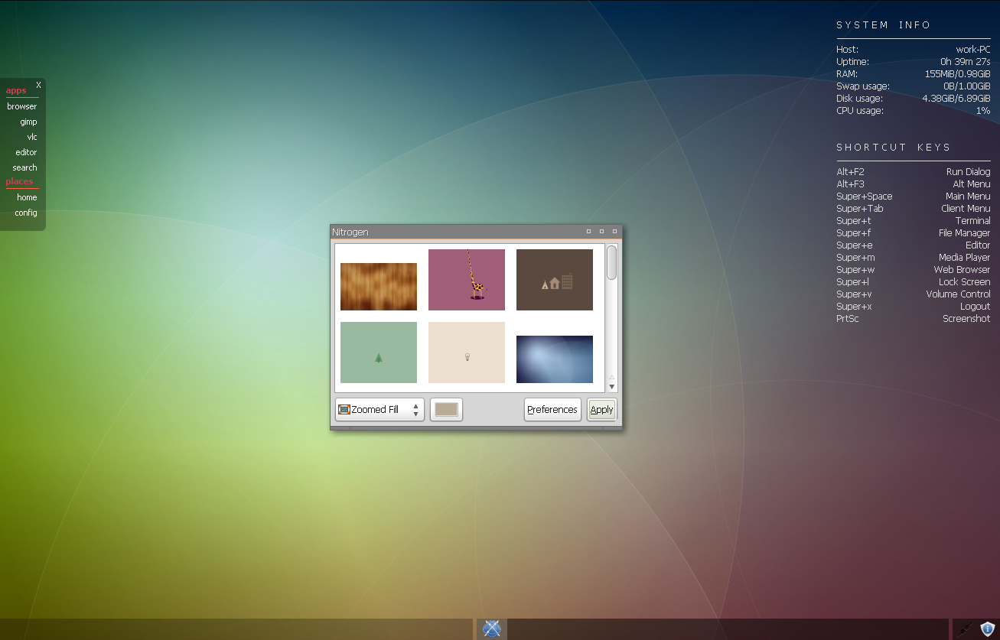

# Webkit App Bar

**Webkit App Bar** was originally intended as an application launcher (on left side in the screenshot) written in Python with using QtWebKit.
Now includes a simple plugin system, allowing the creation of any kind of desktop widget.

## Download

Webkit App Bar [Qt4 vesion](dist/webkit_app_bar4.zip)
\- for a little bit older distros like Debian 8, \*buntu 16.04 LTS, Mint 18.\*

Webkit App Bar [Qt5 vesion](dist/webkit_app_bar5.zip)
\- for distros, which removed Qt4 webkit support, beginning with Debian 9, \*buntu 17.10, Manjaro 17.\* ... and newer

## Changes

17.9.2017

\- new Qt5 & Python 3 version

3.1.2016

\- cleanup qBrowser code a bit, new example "active area", new intellihide option in "autohide" example

16.3.2015

\- added Fluxbox to the list of supported WMs

5.5.2014

\- fixed WM detection

20.9.2013

\- fixed problem with diacritics in the application path, thanks to lillgrinn

4.4.2013

\- new version with plugin support - few examples included ;-)

19.4.2013

\- few fixes, new "empty project", new example - app launcher with autohide property
